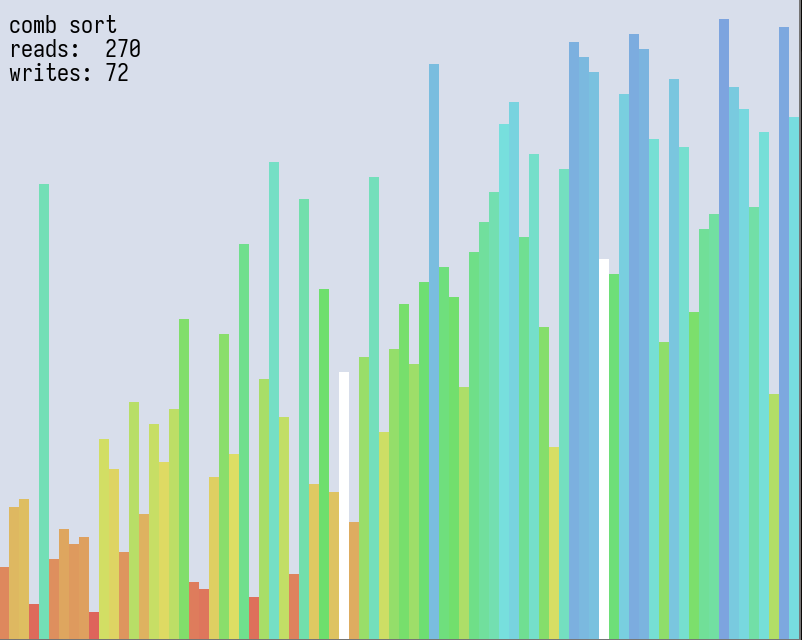
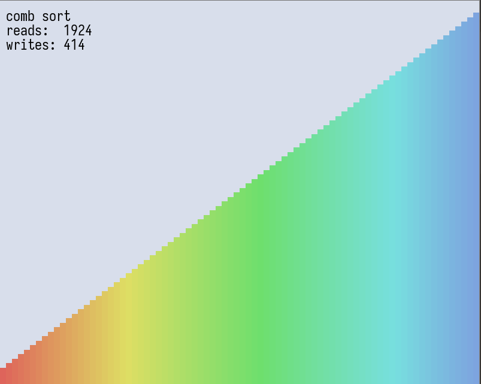

# orst - a simple sorting algorithm visualiser

orst is a super simple program which visualises different sorting algorithms; nothing original, just something a little fun! (⌒‿⌒)

the name is just the letters of "sort" sorted alphabetically.

## usage

simply run orst from the command line. it defaults to comb sorting 40 bars. the command line options are:

```
Options:
  -b, --bars <BARS>            [default: 40]
  -w, --width <WIDTH>          [default: 20]
  -a, --algorithm <ALGORITHM>  [default: comb] [possible values: see below]
  -f, --fps <FPS>              [default: 60.0]
  -l, --list-type <LIST_TYPE>  [default: shuffled] [possible values: shuffled, reversed, ordered]
  -h, --help                   print help
```

## adding algorithms

adding a sorting algorithm is super easy! all you have to do is define a new struct containing all the needed local state for the algorithm (e.g. the location of pointers, the biggest element found so far, ...). then you need to implement the `Algorithm` trait on that struct. `Algorithm` has an associated type `Item`, which needs to implement `ListItem`. any type that implements `ListItem` needs to be `Ord` (it needs to be able to compared to other instances), `Clone` and `From<usize>` (i.e. there needs to be a way to take a `usize` and convert it into an instance of the type). orst provides you with `Bar`, a type that already implements `ListItem`.

implementing `Algorithm` means supplying a few things:
* providing a method called `name()`, which returns a `&'static str` containing the name of the algorithm,
* providing a method called `new()` which returns a fresh instance of the local state,
* providing a method called `reset(&mut self)`, whose behaviour should be identical to the following piece of code:
```rust
fn reset(&mut self) { *self = Self::new(); }
```
* most importantly, providing the `tick(&mut self, l: &mut List) -> AlgorithmState` method.  
  `tick()` is essentialy "one step" of your algorithm. this could be comparing two values, advancing a pointer, swapping two elements, etcetera. it returns an `AlgorithmState`, an enum with two possible values: `Busy` and `Done`. if the algorithm returns `Done`, orst will await user input (specifically the right arrow key), reshuffle the array and start anew.

## currently supported algorithms (lots more to come)
 * gnome sort
 * bubble sort
 * optimised bubble sort
 * comb sort
 * insertion sort

## screenshots
comb sort in action:

a finished state:
